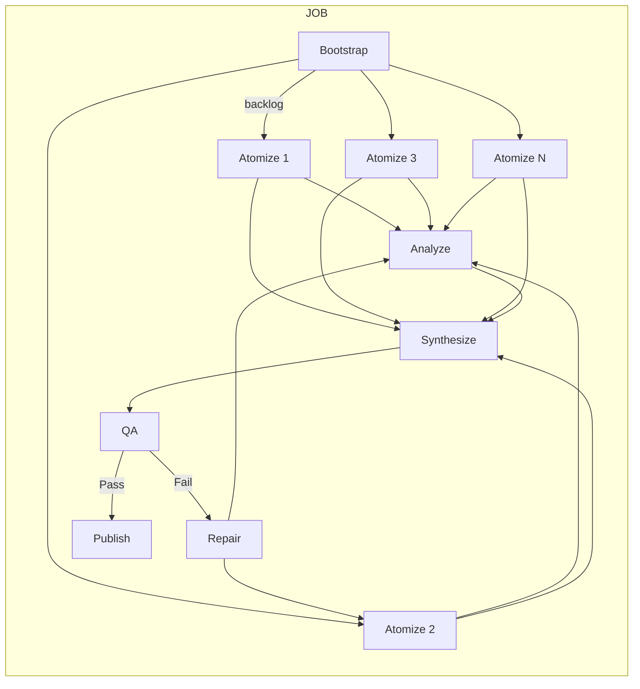
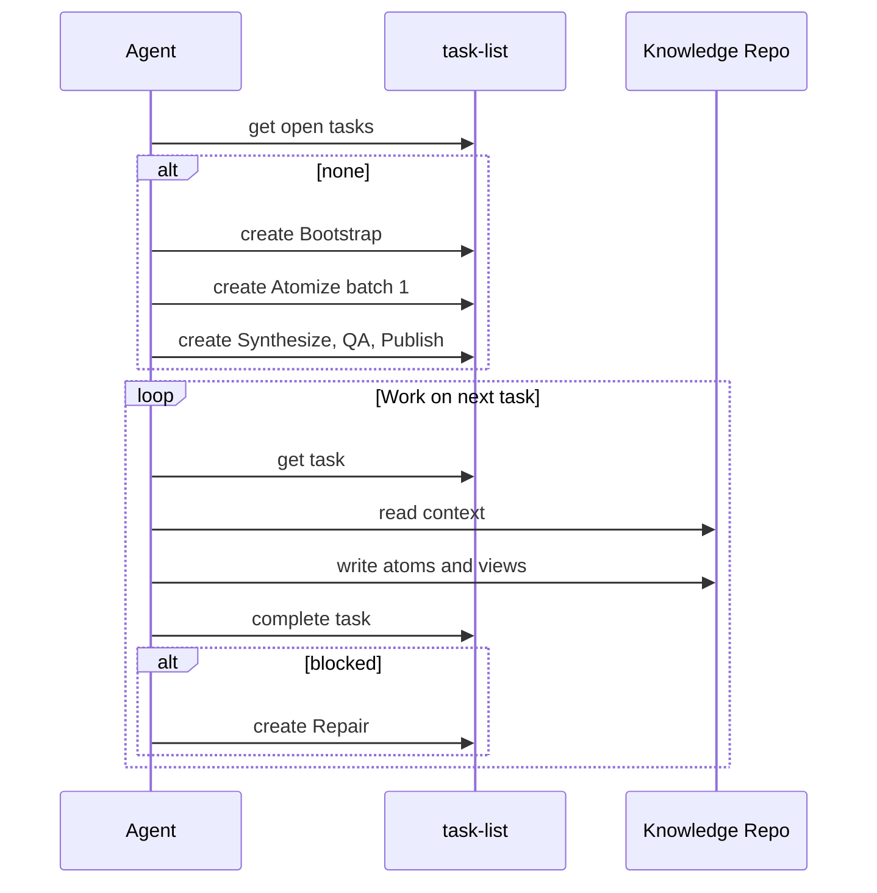
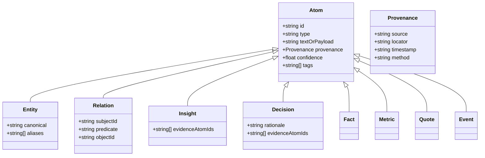
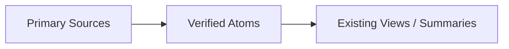
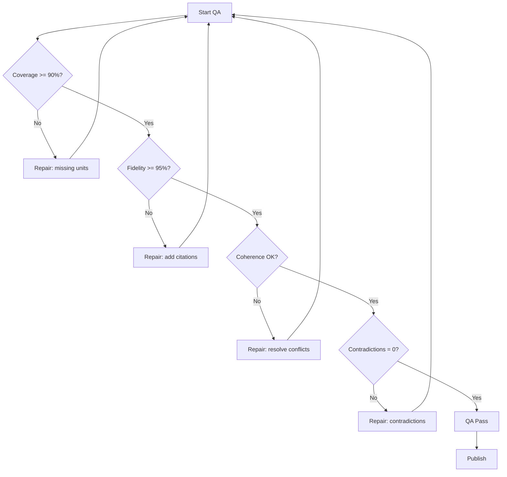
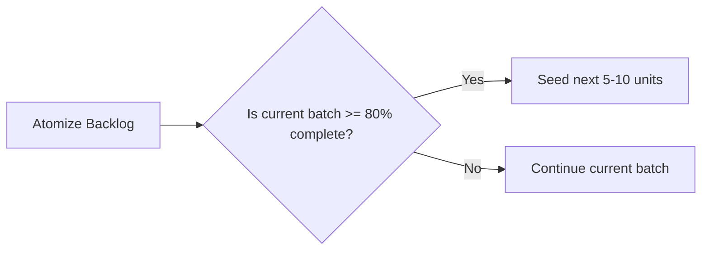

# Lean Agent Task Framework

A domain-agnostic, repeatable framework for large tasks executed within a day on a local machine, using only four task-list operations (`create task`, `get open tasks`, `get task`, `complete task`) and a Knowledge Repo. Deliverables must be traceable to cited atoms.

---

## 1) Definition of Done (DoD)
- Clear deliverable for the job (overview, insights, plan, etc.).
- Knowledge Repo contains atoms with provenance; summaries are views derived from atoms.
- QA thresholds met: Coverage, Fidelity (cite-on-claim), Coherence, Contradictions resolved or justified.

---

## 2) Operating Assumptions
- Single-day jobs; no background refresh.
- Separate agent instances per run (no role-splitting needed).
- Local execution; minimal observability is acceptable.
- Order of Truth for context: Primary Sources -> Verified Atoms -> Existing Views or Summaries.

---

## 3) Core Task Types (domain-agnostic)
- **Bootstrap**: define scope, 3–7 questions, create Spine (themes/process/entities), build backlog of units (chapters/files/datasets/sources).
- **Intake** (optional): gather and normalize sources; assign locators/timestamps; light indexing.
- **Atomize (per-unit)**: extract atoms with citations: Fact, Entity, Relation, Metric, Quote, Event, Insight, Decision (+confidence).
- **Analyze** (optional): answer specific questions from Spine; record Insight/Hypothesis with evidence links.
- **Synthesize**: merge into views (overview, timeline, flow/map, comparisons); optional recommendations.
- **QA**: check Coverage, Fidelity, Coherence, Contradictions; if fail, open Repair tasks.
- **Repair**: patch gaps (missing citations, conflicts) in narrow scope.
- **Publish**: package deliverable; every claim links back to repo atoms.

Seed Atomize tasks in batches of 5–10 high-value units; create the next batch only when the current batch is >= 80% complete.

### Diagram v1.2 – High-Level Pipeline
```mermaid
flowchart TD
  A[Start DoD] --> B[Bootstrap]
  B --> C{Need Intake?}
  C -- Yes --> I[Intake]
  C -- No --> D[Seed Batch 1]
  I --> D
  D --> E[Atomize]
  E --> F{Any Analyze?}
  F -- Yes --> G[Analyze]
  F -- No --> H[Synthesize]
  G --> H
  H --> Q{QA Gates}
  Q -- Fail --> R[Repair]
  R --> D
  Q -- Pass --> P[Publish]
  P --> Z[End]
  E --> B1{Batch >= 80%?}
  B1 -- Yes --> D2[Seed Next Batch]
  D2 --> E
  B1 -- No --> H
````

---

## 4) Task Description Template (7 parts, natural language)

Every task description should contain:

1. **Outcome** – 1–2 sentences tied to DoD.
2. **Inputs** – scope, sources, time window, parameters.
3. **Outputs** – atoms/views to write; citation requirements.
4. **Steps** – 4–8 bullet actions.
5. **Acceptance Criteria (AC)** – conditions to complete task.
6. **Cursor** – where to resume if interrupted.
7. **Deps** – prerequisites if any.

### Naming and Idempotency

* **JOB**: `JOB:<purpose>@<scope>@<date>` (example: `JOB:market-research@SEA-QR-pay@2025-09-15`)
* **Task title**: `[JOB:<...>] [TYPE:<...>] [TARGET:<scope>] [FP:<fingerprint>]`
* **Fingerprint (FP)**: hash key parameters (scope/source/time).
  Before creating a task, always `get open tasks` to avoid duplicates with the same JOB/TYPE/TARGET/FP.

---

## 5) Operational Loop (using only the four ops)

1. `get open tasks` for this JOB. If none, seed: 1 Bootstrap, 0–N Intake, batch-1 Atomize (5–10 units), 1 Synthesize, 1 QA, 1 Publish.
2. If tasks exist, pick by priority: Repair -> Bootstrap -> Atomize/Analyze -> Synthesize -> QA -> Publish.
3. For the selected task: `get task` -> assemble context per Order of Truth -> execute Steps -> write Outputs to Repo.
4. If AC met -> `complete task`. If blocked -> create Repair (describe issue and needed source) and keep current task open.
5. When >= 80% of the current Atomize batch is complete -> seed the next batch.

### Diagram v1.2 – Task Life-Cycle

```mermaid
stateDiagram
  [*] --> PENDING
  PENDING --> RUNNING: get task
  RUNNING --> RUNNING: update cursor
  RUNNING --> SUCCEEDED: complete task
  RUNNING --> FAILED: blocked
  FAILED --> PENDING: repair
  SUCCEEDED --> [*]
```

### Diagram v1.2 – Dependency DAG (per JOB)



### Diagram v1.2 – Agent, Task-List, Knowledge Repo (Sequence)



---

## 6) Knowledge Repo – Mini-Schema (minimum viable)

Common fields for all atoms: `type`, `text_or_payload`, `provenance{source, locator}`, `confidence(0-1)`, `tags[]`.

* **Entity**: `canonical`, `aliases[]`.
* **Relation**: `subject_id`, `predicate`, `object_id` (example: A depends\_on B).
* **Fact**: verifiable claim with citation.
* **Metric**: numeric measurement with units and capture time.
* **Quote**: short quotation, within citation fair use limits.
* **Event**: time-stamped occurrence.
* **Insight**: interpretation linking to evidence atoms.
* **Decision**: recommendation or action with rationale and evidence links.

Record negative evidence with `refutes:<atom_id>` when a source contradicts an existing atom.

### Diagram v1.2 – Atoms Class Diagram



### Diagram v1.2 – Order of Truth



---

## 7) Conflict Policy (light, single-day)

When two atoms disagree, prefer in order:

1. more specific locator (narrower span)
2. newer provenance timestamp
3. more independent evidence

If unresolved, keep both with contradiction notes and open a Repair task.

---

## 8) QA Gates (defaults)

* Coverage >= 90% of units have atoms.
* Fidelity >= 95% of claims/insights have citations.
* Coherence: no internal contradictions across views/atoms, or contradictions are flagged and assigned to Repair.
* Contradictions: 0 after the Repair pass (or remaining conflicts are explicitly justified).

### Diagram v1.2 – QA Decision Flow



---

## 9) Priority Heuristics

* High information value first (units with broad connections or impact on conclusions).
* Time-sensitive sources earlier to lock a snapshot.
* Fan-out tasks (unblock many dependents) before narrow ones.
* QA pressure: work on failing gates via targeted Repairs.

### Diagram v1.2 – Batch Seeding Heuristic



---

## 10) Copy-Ready Task Templates

### 10.1 Bootstrap

**Title**: `[JOB:<purpose@scope@date>] [TYPE:Bootstrap] [TARGET:all] [FP:<hash>]`
**Description**:

* Outcome: define scope, questions, initial Spine; produce prioritized backlog of units.
* Inputs: `<scope>`, `<time>`, seed sources.
* Outputs: Spine atoms; backlog list with locators.
* Steps: (1) List questions; (2) Identify units and priority; (3) Write Spine/backlog with citations.
* AC: >= 3 questions; >= 80% key units listed; all claims cited.
* Cursor: `last_listed_unit=...`
* Deps: none.

### 10.2 Atomize (per-unit)

**Title**: `[JOB:<...>] [TYPE:Atomize] [TARGET:<unit-id>] [FP:<hash(unit+date)>]`
**Description**:

* Outcome: extract atoms with provenance from `<unit-id>`.
* Inputs: `<unit-id>`, Spine, related atoms.
* Outputs: Facts/Entities/Relations/Metrics/Quotes/Events (+confidence).
* Steps: (1) Read source; (2) Normalize entities/relations; (3) Write atoms with citations.
* AC: >= 1 citation per claim; entity aliases normalized.
* Cursor: `offset=...`
* Deps: Bootstrap (and Intake if used).

### 10.3 Synthesize

**Title**: `[JOB:<...>] [TYPE:Synthesize] [TARGET:all] [FP:<hash(atoms@date)>]`
**Description**:

* Outcome: merge atoms into views (overview/timeline/flows/maps/compare), optional recommendations.
* Inputs: atoms from Atomize/Analyze.
* Outputs: views + cross-links to atoms.
* Steps: deduplicate, resolve contradictions, stitch views; keep citations.
* AC: coherence pass; coverage meets Spine.
* Deps: Atomize/Analyze.

### 10.4 QA

**Title**: `[JOB:<...>] [TYPE:QA] [TARGET:all] [FP:<hash(synthesis@date)>]`
**Description**:

* Outcome: verify Coverage/Fidelity/Coherence/Contradictions; open Repairs if needed.
* Inputs: views + atoms.
* Outputs: QA notes; Repair tasks (if fail).
* Steps: check thresholds and contradiction sets.
* AC: all thresholds met or Repair tasks created.
* Deps: Synthesize.

### 10.5 Publish

**Title**: `[JOB:<...>] [TYPE:Publish] [TARGET:deliverable] [FP:<hash>]`
**Description**:

* Outcome: produce final deliverable; every claim links to repo atoms.
* Inputs: QA-passed views + atoms.
* Outputs: executive summary / brief / memo / plan.
* AC: all claims traceable to citations.

### 10.6 Repair

**Title**: `[JOB:<...>] [TYPE:Repair] [TARGET:<scope>] [FP:<hash(issue)>]`
**Description**:

* Outcome: resolve a specific gap (missing cite, conflict).
* Inputs: problem description, related sources.
* Outputs: new or corrected atoms; justification if unverifiable.
* AC: targeted QA check passes for the repaired item.
* Deps: task that raised the issue.
